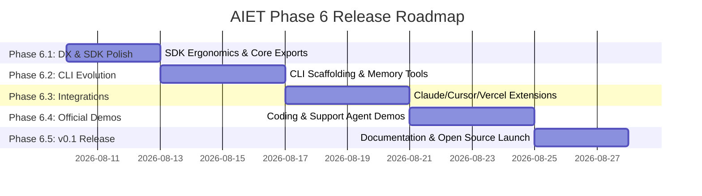

# Phase 6: Architecture & Productization Review — AI Engineering Toolkit (AIET)

> **Lead Architect & Product Engineer Assessment for AIET Open-Source Platform Evolution**  
> *Date: August 8, 2026*

---

## Executive Summary

The **AI Engineering Toolkit (AIET)** has reached a critical architectural milestone. Over Phases 1 through 5, AIET evolved from a deterministic context compiler into a complete autonomous agent memory infrastructure engine featuring:
- **Local-first SQLite WAL storage** with hybrid FTS5 BM25 + Vector embedding search (RRF)
- **Autonomous Memory Formation**: `@aiet/extractor`, `@aiet/decision-engine`, `@aiet/governance`, and `@aiet/consolidation`
- **Zero-Egress Privacy Enforcement** and immutable audit logging
- **Framework Adapters** (`@aiet/adapter-vercel`, `@aiet/mcp-server`)
- **Monorepo Scale**: 24 workspace projects, 23 TypeScript packages, 141/141 passing tests, clean builds, typechecking, and linting.

However, **a powerful infrastructure is not automatically an adoptable product**. Currently, AIET is internally robust but externally fragmented for a developer trying it for the first time. The primary objective of Phase 6 is to transform AIET from an engineering toolkit into a developer-centric open-source platform.

---

## 1. Current AIET Maturity Level Assessment

| Subsystem | Components | Maturity | Gaps / Prerequisites for Public Release |
| :--- | :--- | :--- | :--- |
| **Deterministic Context Compiler** | `@aiet/compiler`, `@aiet/compiler-cli`, `@aiet/schema`, `@aiet/domain` | **Production Ready** | CLI output formatting could be more developer-friendly; error messages need DX polishing. |
| **Local Memory Storage** | `@aiet/storage`, SQLite WAL, FTS5, RRF | **Production Ready** | Migration tooling for external apps needs standard initialization helpers. |
| **Hybrid Vector Embeddings** | `@aiet/embeddings`, `@aiet/embeddings-openai`, `@aiet/embeddings-ollama` | **Production Ready** | Needs seamless fallback to mock/local providers when API keys are absent. |
| **Autonomous Memory Formation** | `@aiet/extractor`, `@aiet/decision-engine` | **Beta / Solid** | Needs unified top-level SDK entry points in `@aiet/core` for single-line background extraction. |
| **Governance & Safety Gate** | `@aiet/governance`, `memory_proposals`, `audit_log` | **Beta / Solid** | Lacks interactive CLI / UI tool to inspect and batch-approve proposals easily. |
| **Consolidation & Lineage** | `@aiet/consolidation`, `memory_lineage`, `memory_contradictions` | **Beta / Solid** | Contradiction resolution flow needs CLI command exposure (`aiet memory resolve`). |
| **Developer Ergonomics & CLI** | `@aiet/cli`, `@aiet/core` SDK | **Experimental / Basic** | CLI lacks interactive configuration wizards, doctor diagnostics, and visual state tools. |

---

## 2. Developer Experience (DX) Audit & Onboarding Gaps

### Current Onboarding Journey (The "Cold Start" Friction)
Today, a developer discovering AIET must:
1. Figure out which of the 23 `@aiet/*` packages to install.
2. Manually set up a SQLite database connection and run schema initializations.
3. Import 4-5 different modules (`@aiet/extractor`, `@aiet/decision-engine`, `@aiet/governance`, `@aiet/storage`) to process a single conversation.
4. Manually configure MCP tools in Cursor or Claude Code configuration files.

### Identified DX Gaps
1. **Package Discovery & Fragmentation**: Too many granular packages exposed at first glance. Developers need a single umbrella package (`@aiet/core` or `aiet`) with clean preset configurations.
2. **Lack of Interactive Setup**: No single command like `npx aiet init` to scaffold `.env`, SQLite DB, and Cursor/Claude Code MCP connections automatically.
3. **No Context Inspection / Explainability ("Why was this context selected?")**: Developers cannot easily inspect *why* a particular primitive was included in an `AGENTS.md` build or Vercel prompt preamble.
4. **Proposal Staging Friction**: Proposal queues exist in SQLite, but developers have to call raw MCP tools or SQL queries to inspect and approve pending proposals.

---

## 3. CLI Product Strategy & Command Design

The `aiet` CLI will become the primary control surface for developers using AIET in local projects.

### Proposed CLI Command Matrix

```
aiet
├── init                # Interactive project scaffolding & configuration wizard
├── doctor              # Health check (SQLite, Node, embedding provider, MCP paths)
├── connect <agent>     # Auto-configures MCP for claude, cursor, or windsurf
├── compile             # Compiles context into AGENTS.md / CLAUDE.md with token budgeting
├── status              # Visual dashboard of stored memories, pending proposals, & index health
│
├── memory
│   ├── list            # Lists active memory primitives with search/type filters
│   ├── search <query>  # Executes hybrid (FTS5 + Vector RRF) memory search from shell
│   ├── inspect <id>    # Displays detailed primitive metadata, importance, and lineage
│   ├── approve [id]    # Interactively inspects and approves/rejects pending proposals
│   ├── resolve [id]    # Interactively resolves detected memory contradictions
│   └── explain <query> # Shows step-by-step scoring (RRF, importance, recency) for context
```

### Command Flow Highlights
- **`aiet init`**: Asks 3 quick questions (Embedding Provider: OpenAI / Ollama / Local Mock; Budget: 500/1000/2000 tokens; Target Files: AGENTS.md / CLAUDE.md / .cursorrules). Generates `aiet.config.json` and initializes local SQLite memory storage.
- **`aiet connect claude|cursor|windsurf`**: Detects local agent config files (e.g. `~/.claude/mcp-config.json` or `.cursor/mcp.json`) and injects the AIET MCP server definition automatically.
- **`aiet memory explain <query>`**: Output visual table breaking down BM25 rank, Vector cosine similarity, Importance weight, Recency decay, and Final RRF score for transparent debugging.

---

## 4. Agent Integration Strategy

AIET will provide zero-friction integration for popular AI agent frameworks.

### Tiered Integration Roadmap

```
           +-------------------------------------------------+
           |          Tier 1: IDE & CLI Agent MCP            |
           |     (Claude Code, Cursor MCP, Windsurf MCP)     |
           +-------------------------------------------------+
                                    |
                                    v
           +-------------------------------------------------+
           |       Tier 2: Framework Ecosystem SDKs          |
           |   (Vercel AI SDK, OpenAI Agents SDK, LangGraph) |
           +-------------------------------------------------+
                                    |
                                    v
           +-------------------------------------------------+
           |         Tier 3: Enterprise Infrastructure        |
           |    (Multi-Tenant Sync, Postgres PGVector Sync)  |
           +-------------------------------------------------+
```

1. **Tier 1: IDE & CLI Agent MCP (Immediate Priority)**
   - **Claude Code MCP**: Native stdio MCP server for project-level memory read/propose/approve.
   - **Cursor MCP**: Auto-generated `.cursor/mcp.json` integration.
   - **Windsurf MCP**: Cascading context & prompt injection.

2. **Tier 2: Framework Ecosystem SDKs (High Priority)**
   - **`@aiet/adapter-vercel`**: Enhance existing streamText middleware with automatic extraction hooks.
   - **`@aiet/adapter-langgraph`**: Add LangGraph memory checkpointer / state sync adapter.
   - **`@aiet/adapter-openai`**: Add memory middleware for OpenAI Assistants & Swarm SDKs.

3. **Tier 3: Enterprise & External Storage Sync (Future Milestone)**
   - Multi-tenant SQLite sync, PostgreSQL pgvector backend adapters, and Cloudflare D1 local-first edge storage adapters.

---

## 5. Demo Applications Strategy (`examples/`)

To prove developer utility, AIET will showcase 4 canonical, end-to-end demo applications in `examples/`:

1. **`examples/coding-agent/`**
   - **Purpose**: A local CLI coding assistant that remembers code architectural rules, refactoring decisions, and past bug fixes.
   - **AIET Features**: `@aiet/compiler` (`AGENTS.md`), `@aiet/mcp-server`, `@aiet/governance` (RESTRICTED secret protection).

2. **`examples/research-agent/`**
   - **Purpose**: A paper & web research agent that extracts key assertions, detects contradictory findings, and merges duplicate references.
   - **AIET Features**: `@aiet/extractor`, `@aiet/consolidation` (duplicate & contradiction detection), hybrid vector search.

3. **`examples/customer-support-agent/`** *(Refactored)*
   - **Purpose**: Next.js / Vercel AI SDK customer support bot with persistent customer preferences and issue history.
   - **AIET Features**: `@aiet/adapter-vercel`, `@aiet/decision-engine` (preference updating), memory importance scoring.

4. **`examples/personal-assistant/`**
   - **Purpose**: Local-first terminal companion using Ollama embeddings that accumulates long-term directives and personal knowledge locally.
   - **AIET Features**: `@aiet/embeddings-ollama`, SQLite local WAL storage, interactive governance proposal approval.

---

## 6. Open Source Positioning & Competitive Matrix

### Competitive Landscape Matrix

| Feature / Architecture | **AIET** | Mem0 | Zep | Letta (MemGPT) | LangChain Memory |
| :--- | :--- | :--- | :--- | :--- | :--- |
| **Architecture** | **Local-First Infrastructure Framework** | Hosted Cloud / Managed Service | Server / Cloud DB | Stateful Agent Server | In-Memory / Relational |
| **Context Compilation** | **Deterministic Token-Budget Compiler (JCS SHA-256)** | None | Summary Buffer | Core Memory Blocks | Simple Buffer Window |
| **Safety & Governance** | **Proposal Queue & Zero-Egress Privacy Boundary** | Standard CRUD | Privacy Filters | Human-in-loop blocks | None |
| **Search Engine** | **SQLite FTS5 BM25 + Vector RRF Hybrid** | Vector-only | Graph + Vector | Vector / Block | Vector / Basic |
| **Open Source Focus** | **Framework for building custom AI agents** | End-user product / API | Server platform | Agent operating system | Component library |

### Unique Positioning Statement
> **"AIET is the local-first infrastructure framework for building self-governing AI agents with deterministic context compilation and hybrid SQLite memory."**

### Target User Persona
- **AI Engineers & Builders** building custom coding agents, CLI tools, or domain-specific vertical assistants who require full control over prompt context budgets, local storage, and memory safety without vendor lock-in.

---

## 7. Phase 6 Release Roadmap



- **Phase 6.1: Developer Experience & Core SDK Polish**
  - Consolidate entry points in `@aiet/core`.
  - Add single-call extraction & governance pipeline helper (`aiet.processConversation()`).

- **Phase 6.2: CLI Product Evolution (`@aiet/cli`)**
  - Implement `aiet init`, `aiet doctor`, `aiet connect`, `aiet memory list/search/inspect/approve/explain`, `aiet status`.

- **Phase 6.3: Framework & Agent Integrations**
  - Refine `@aiet/adapter-vercel` stream middleware.
  - Add auto-installer for Claude Code / Cursor / Windsurf MCP configs.

- **Phase 6.4: Official Demo Applications (`examples/`)**
  - Build `coding-agent`, `research-agent`, `customer-support-agent`, and `personal-assistant`.

- **Phase 6.5: v0.1 Public Release Preparation**
  - Polish README.md, documentation site, contributing guidelines, and CI release workflow.

---

## 8. Architectural Simplification & Tech Debt Audit

To ensure maximum maintainability before public open-source release, the following refactorings are recommended:

1. **Keep Package Count Clean**:
   - The current 23 TypeScript packages represent clean single-responsibility boundaries. However, end-users should only need to depend on `@aiet/core` for runtime or `@aiet/cli` for tooling.
2. **Consolidate Internal Type Duplications**:
   - Ensure all schema enums (`EntityType`, `AssertionType`, `SensitivityTier`) flow strictly from `@aiet/schema` without duplicate definitions in subproject test helpers.
3. **Storage Transaction Ergonomics**:
   - `PAKBStorageRepository` handles SQLite connections cleanly; add high-level batch execution methods to reduce raw SQL string queries in higher-level packages (`@aiet/governance`, `@aiet/consolidation`).

---

## Conclusion & Next Step

AIET is architecturally complete and robust across Phases 1–5. By executing Phase 6 focusing exclusively on **Developer Experience, CLI Productization, Seamless Agent Integrations, and Production Examples**, AIET will be fully ready for its public v0.1 open-source release.

> **Status: Architectural Review Complete. Awaiting User Approval before proceeding with Phase 6.1 implementation.**
