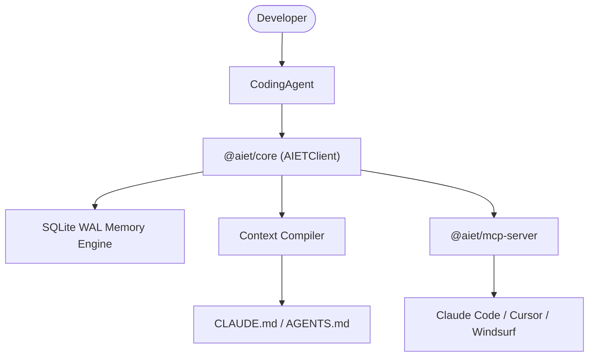

# AIET Official Demo: AI Coding Assistant

This official example demonstrates how software engineers build an AI Coding Assistant with persistent memory, architecture tracking, and context compilation using the **AI-Engineering-Toolkit (AIET)**.

---

## 1. Architecture Diagram



---

## 2. AIET Infrastructure Components Used

- **`@aiet/core`**: Unified facade API (`AIETClient`, `MemoryClient`, `CompilerClient`).
- **`@aiet/schema`**: Strongly-typed primitive schemas (`Directive`, `Assertion`).
- **`@aiet/domain`**: ULID generation and domain rules.
- **`@aiet/mcp-server`**: Model Context Protocol integration for AI IDEs.

---

## 3. Installation & Setup

```bash
# From workspace root
corepack pnpm install --filter @aiet/example-coding-agent...
```

---

## 4. Running the Demo

```bash
# Run using tsx
corepack pnpm --filter @aiet/example-coding-agent start

# Run unit tests
corepack pnpm --filter @aiet/example-coding-agent test
```

---

## 5. Example Interaction

```text
User: "Use functional programming style with strict TypeScript types."
Agent: [Persists Directive primitive `dir_01J...`]

User: "AIET SQLite database is the primary local memory store."
Agent: [Persists Assertion primitive `ast_01J...`]

User: "Implement user authentication service"
Agent:
  - Retrieves Directive: "Use functional programming style with strict TypeScript types."
  - Retrieves Fact: "AIET SQLite database is the primary local memory store."
  - Compiles Budget-Fitted `AGENTS.md` context file for LLM session.
```
