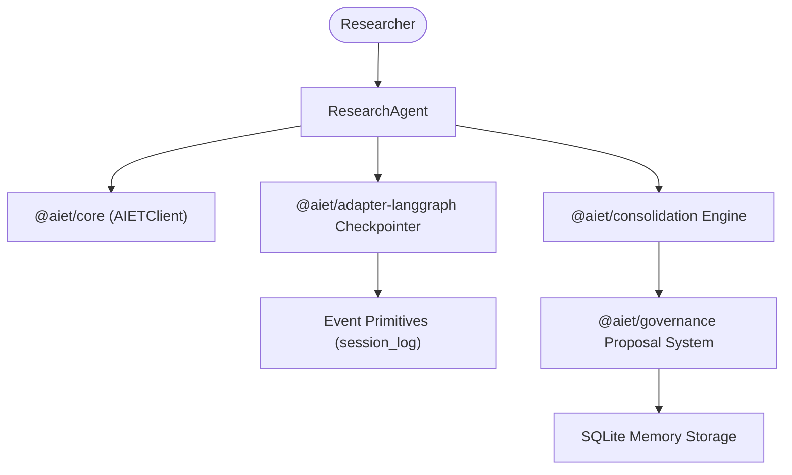

# AIET Official Demo: Long-Running Research Agent

This official example demonstrates how researchers and knowledge engineers build a long-running, multi-session AI Research Agent using **AIET**, `@aiet/adapter-langgraph`, and `@aiet/consolidation`.

---

## 1. Architecture Diagram



---

## 2. AIET Infrastructure Components Used

- **`@aiet/core`**: Unified facade API for retrieval and memory management.
- **`@aiet/adapter-langgraph`**: Graph state checkpointer persisting state checkpoints as governed `Event` primitives.
- **`@aiet/consolidation`**: Semantic contradiction & duplicate detection engine.
- **`@aiet/governance`**: Mandatory governance safety layer for memory mutation proposals.

---

## 3. Installation & Setup

```bash
# From workspace root
corepack pnpm install --filter @aiet/example-research-agent...
```

---

## 4. Running the Demo

```bash
# Run using tsx
corepack pnpm --filter @aiet/example-research-agent start

# Run unit tests
corepack pnpm --filter @aiet/example-research-agent test
```

---

## 5. Example Interaction

```text
Session 1:
Researcher: "Record finding: AIET memory system latency benchmark is 45ms (source: paper_2025_v1.pdf)"
Agent: Stores Assertion `ast_01J...` and saves LangGraph checkpoint `evt_01J...`.

Session 2:
Researcher: "Discovered updated finding: AIET memory system latency benchmark is 12ms under SQLite WAL mode"
Agent: Runs `@aiet/consolidation` engine -> Detects contradiction -> Traps mutation in `@aiet/governance` proposal system for approval.
```
